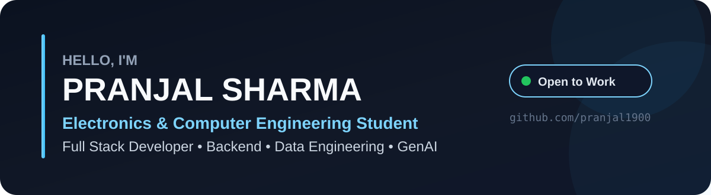

<div align="center">



<br/>

<a href="https://github.com/pranjal1900">
  
</a>
<a href="https://www.linkedin.com/in/pranjal-sharma">
  
</a>
<a href="mailto:psharma7be23@thapar.edu">
  
</a>

</div>

---

## About Me

```ts
const pranjal = {
  role: [
    "Electronics & Computer Engineering Student",
    "Full Stack Developer"
  ],

  building: [
    "Full-stack web applications",
    "Secure REST APIs",
    "Backend systems",
    "Data-driven products"
  ],

  exploring: [
    "GenAI",
    "AI/ML",
    "Microservices",
    "Data Engineering"
  ],

  openTo: [
    "Software Engineering Internships",
    "Full Stack Roles",
    "Backend Roles",
    "Data Engineering Roles"
  ]
};
```

---

## Featured Projects

<table>
<tr>
<td width="50%" valign="top">

### ✈️ Flight Booking Application

A full-stack flight booking platform with secure APIs, RBAC, payments, automated PDF e-tickets, and QR-based verification.

**Stack**  
`React.js` `Node.js` `Express.js` `MongoDB` `Redis` `Stripe` `JWT`

**Highlights**
- Secured 15+ REST API endpoints
- Stripe-based payment flow
- Automated PDF ticket generation
- QR-based passenger verification

<a href="https://flight-booking-application-seven.vercel.app/">
  
</a>
<a href="https://github.com/pranjal1900/Flight-Booking-Application">
  
</a>

</td>
<td width="50%" valign="top">

### 🚗 Car Auction Platform

A full-stack auction platform with relational data modeling, bidding logic, RBAC, admin workflows, and cloud deployment.

**Stack**  
`Next.js 14` `TypeScript` `PostgreSQL` `Prisma` `Node.js` `Vercel`

**Highlights**
- Automated incremental bidding
- Reserve-price validation
- Buyer / Seller / Admin RBAC
- Multi-stage approval workflows

<a href="https://github.com/pranjal1900/CarAuctionPlatform">
  
</a>

</td>
</tr>
</table>

---

## Tech Stack

### Languages
<p>
  
  
  
  
  
  
</p>

### Frontend & Backend
<p>
  
  
  
  
  
</p>

### Databases & Tools
<p>
  
  
  
  
  
  
  
  
</p>

---

## Engineering Focus

<table>
<tr>
<td><b>Backend</b><br/>REST APIs, authentication, RBAC, microservices</td>
<td><b>Full Stack</b><br/>React, Next.js, Node.js, TypeScript</td>
</tr>
<tr>
<td><b>Data</b><br/>PostgreSQL, MongoDB, Redis, Prisma</td>
<td><b>Emerging Tech</b><br/>GenAI, AI/ML, automation, data engineering</td>
</tr>
</table>

---

## Current Goal

I'm focused on becoming a stronger software engineer by building production-style systems, improving backend and system-design fundamentals, and deepening my knowledge of data engineering and AI-enabled products.

> **Open to internships and entry-level opportunities in Software Engineering, Full Stack, Backend, and Data Engineering.**

---

## Connect

<div align="center">

<a href="https://www.linkedin.com/in/pranjal-sharma">
  
</a>
<a href="https://github.com/pranjal1900">
  
</a>
<a href="mailto:psharma7be23@thapar.edu">
  
</a>

<br/><br/>


</div>
